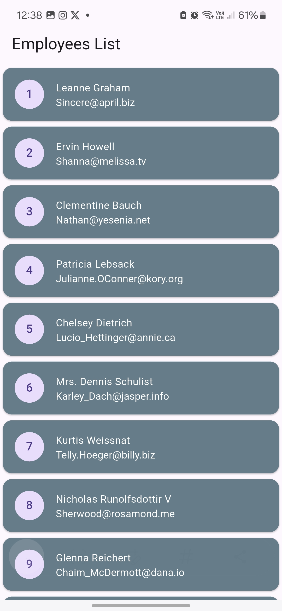
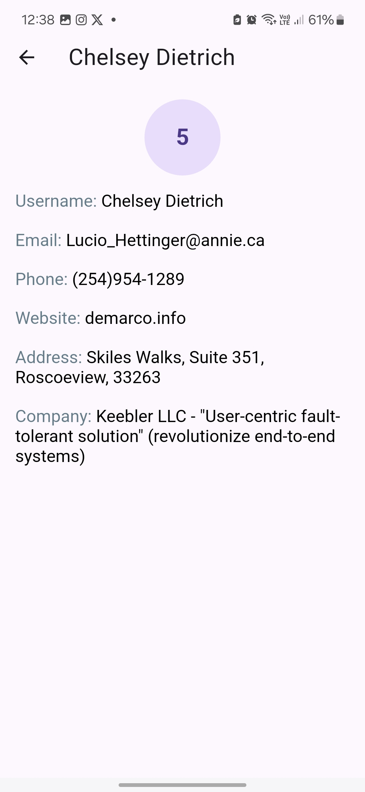

# sprints_dio_task

A new Flutter project.

## Overview

This project is a simple task for Fetch employee data using Dio and implement error handling using try-catch then parse JSON responses and map them to model then cache the employee list locally.

1. Fetch employee data using dio
2. Implement proper error handling using try-catch.
3. Navigate between two screens and pass data to the details page.
4. Display a loading indicator while fetching data.
5. Cache the employee list locally using shared_preferences and load it on app restart.

## 📸 Screens

    
    
    

